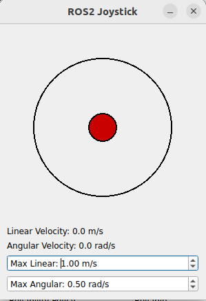

# Joystick GUI for ROS2

A ROS2 package that provides a graphical joystick interface using Qt5 to control robots via geometry messages. The joystick is controlled via mouse. This joystick publishes either geometry_msgs::msg::Twist or geometry_msgs::msg::TwistStamped messages on a configurable topic, allowing users to control linear and angular velocities interactively.



## Features

- Graphical Joystick Interface: Intuitive GUI for controlling robots.
- Configurable Parameters: Set topic name, maximum linear and angular velocities, message type, and angular inversion via ROS2 parameters.
- Adjustable Max Velocities: Change max velocities on-the-fly using spin boxes in the GUI.
- Display Current Velocities: Real-time display of current linear and angular velocities.
- Supports Twist and TwistStamped: Publish either Twist or TwistStamped messages.
- Invert Angular Direction: Option to invert angular velocity direction to match robot control conventions.


## Prerequisites
- Operating System: 
    - Ubuntu 20.04 or later.
- ROS2: 
    - Foxy, Galactic, Humble, or Rolling.
- Qt5 Development Libraries:
```
sudo apt-get install qtbase5-dev qt5-default libqt5widgets5 libqt5gui5 libqt5core5a
```
## Installation
- Clone the Repository:

```
cd ~/your_ros2_workspace/src
git clone https://github.com/foiegreis/ros2_joystick_gui.git
```
- Navigate to Workspace:

```
cd ~/your_ros2_workspace
```
- Build and source:
```
source /opt/ros/<your_ros2_distro>/setup.bash
Replace <your_ros2_distro> with foxy, galactic, humble, etc.
colcon build --packages-select ros2_joystick_gui

```

- Run the Node from bash:
```
ros2 run ros2_joystick_gui joystick_widget_node
```

- Optional Parameters:

Set parameters at runtime using --ros-args -p parameter_name:=value.
Example:
```
ros2 run joystick_gui_cpp joystick_widget_node --ros-args \
  -p topic_name:=/robot/cmd_vel \
  -p max_linear_velocity:=2.0 \
  -p max_angular_velocity:=1.0 \
  -p invert_angular:=true \
  -p message_type:=twist
```
## Run node from launch file
You can run the node from a ROS2 launch file in this declaring the parameters in this fashion:
```
    joy_widget_node = Node(
            package='ros2_joystick_gui', 
            executable='joystick_widget_node', 
            name='joystick_widget_node',
            parameters=[{
                'topic_name': 'joy_widget_cmd_vel',
                'max_linear_velocity': 1.0,
                'max_angular_velocity': 0.8,
                'invert_angular': True,
                'message_type': 'twist' 
            }]
    )
        
```

## Parameters
The node supports several ROS2 parameters for configuration:

- topic_name (string, default: "cmd_vel"): The topic on which to publish messages.

- max_linear_velocity (double, default: 1.0): The maximum linear velocity.

- max_angular_velocity (double, default: 1.0): The maximum angular velocity.

- invert_angular (bool, default: false): Invert the direction of the angular velocity.
    When invert_angular is true:

    - Moving the joystick to the left results in a positive angular velocity (turning left).
    - Moving the joystick to the right results in a negative angular velocity (turning right).

- message_type (string, default: "twist", options: "twist" - "twist_stamped"): The type of message to publish.


## Gui Parameters setup
You can also use the spin boxes labeled "Max Linear" and "Max Angular" to adjust the maximum velocities while the node is running.

## Contributing
Contributions are welcome! Please open an issue or submit a pull request on GitHub.

## Support
If you encounter any problems or have questions, feel free to open an issue on the GitHub repository.


